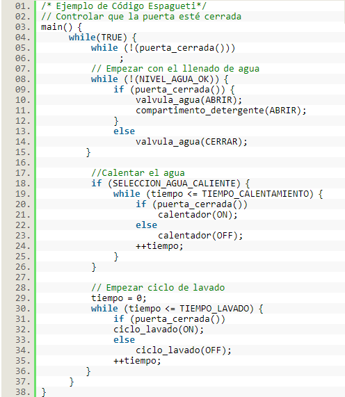
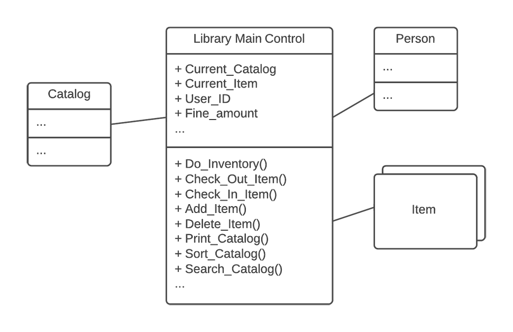
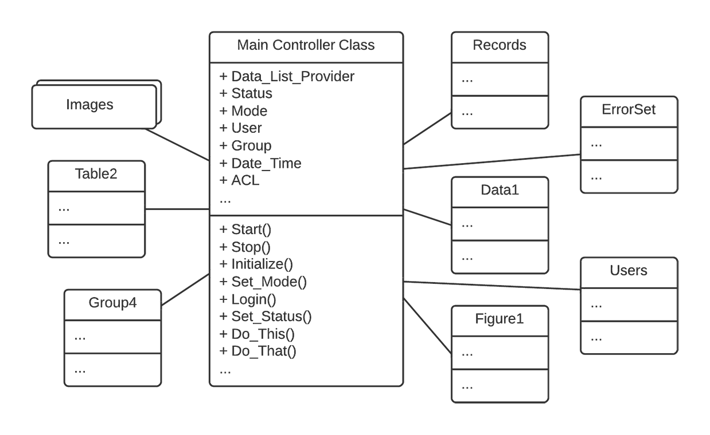

# Anti-patrones
## Autores: Luis Guillermo Velez - Johan Aguirre Diaz
### Código muerto
Consiste en crear grandes cantidades de código con poca documentación, de forma desordenada y poca claridad de su funcionamiento en el sistema. A medida que el proyecto avanza en su desarrollo el sistema se hace solidifica y resulta más complicado cambiar funcionalidades, documentarlo, reutilizarlo e incluso entenderlo. También se conoce como "Lava flow" ya que caracteriza a los trozos de código (flujo de lava), y a medida que avanza el proyecto se dificulta el cambiar o mejorar este código (flujo de lava seco y endurecido).

##### Principales Sintomas:
* Se crean variables, objetos o lineas de código que no son justificadas.
* Los nombres de las variables, clase y/o objetos no se relacionan con su funcionalidad.
* Se construyen clases o muchas lineas de código complejas sin documentar.
* Existen muchas áreas de codigo por terminar o por reemplazar.

##### Consecuencias: 
* Se genera perdida de modularidad del cóidgo, esto dificulta la reutilización de fragmentos de código. Esto implica que el codigo sea mas confuso y pueda contener funcionalidades duplicadas.
* Se dificulta documentar el código.
* Se dificulta la posibilidad de mejorar el código a medida que va avanzando el desarrollo del programa.

##### Causas:
* El sistema fue puesto en producción sin revisión previa.
* No existe una arquitectura definida.
* El desarrollo esta a cargo de una sola persona.
* Existen varios métodos de prueba.
* El código debe ser corregido constantemente.

##### Solucion:
* Tener un desarrollo comentado y estructurado desde el comienzo del proyecto.
* Eliminar partes no funcionales del código (código muerto).

##### Ejemplo:
```java
 public int Sumar_Numeros (int a, int b){
    int c=b-a
    return a+b
 }
```

### Fantasma
Consiste en un numero grande de clases (Fantasmas) o de tablas en una base de datos, con muy pocas responsibildades. Existe un gran número de clases con un ciclo de vida breve, que disfrazan la idea de que el sistema esta construido bajo unos pocos módulos, arhivos o clases,y ocultar las presencia del anti-patron The God.

##### Principales Sintomas:
* El diseño es inestable.
* El rendimiento del sistema es pobre.
* Se dificulta mejorar o cambiar el código ya que se dificulta encontrar los elementos relevantes del sistema.


##### Causas:
* El diseño del proyecto no coincide con la implementacíon.
* Las clases del proyecto aparecen solamente para iniciar un método.

##### Solucion:
* Eliminar clases fantasmas.
* Replantear un diseño sólido del proyecto.

##### Ejemplo:
```java
  public class Multiplicacion{
      public int Multiplicar_numeros(int a, int b){
        return a*b;
      }
  }
  public class Recibir_numeros{
      public void ir_multiplicacion(int c, int z){
         operacion= Multiplicacion();
         operacion.Multiplicar_numeros(c,z);
      }
  }
  package Fantasma;
  import java.util.Scanner;
  public class Usuario{
      public static void main(String[] args) {
          int numero1,numero2;
          System.out.println("Digite los respectivos numeros");
          Scanner leer=new Scanner(System.in);
          numero1=leer.nextInt();
          numero2=leer.nextInt();
          usuario= Recibir_numeros(); 
          usuario.ir_multiplicacion(numero1,numero2);
      }
  }
  
```
## Codigo Espagueti

Es un término despectivo en el ámbito de la programación sobre un código enrevesado sin necesidad, particularmente por las ramificaciones de una parte del código con otro. A veces el spaghetti code es el resultado de múltiples modificaciones de un código antiguo.

Otra analogía de que se llame spaghetti es cuando se realiza un cambio en una parte del código y se tienen efectos impredecibles sobre el resto del programa, como cuando halas un tira de espagueti y afecta a las otras

#####Ejemplo 


* imagen obtenida de https://www.tecbolivia.com

Del anterior codigo podemos ver que :

* Dentro de cada uno de las secciones principales del programa (llenado de agua, calentado y ciclo de lavado) se hace importante revisar que la puerta de la lavadora esté cerrada, ya que si la puerta es abierta por algún motivo, la operación en curso debe ser inmediatamente detenida por seguridad.  Además el agregar otras funciones adicionales complica el seguimiento del codigp


## Objeto todo poderoso

El Objeto todo poderoso es un objeto que hace mucho más de lo que debería, esto quiere decir que  no cumple con el principio de única responsabilidad, crece de manera descontrolada y se encarga de tantas cosas diferentes que todo el sistema termina dependiendo de él.

#####¿Por qué es malo?

*	Lo primero es que una clase tan grande seguramente será muy difícil de testear y de mantener debido a su complejidad.
*	Una clase con tantas responsabilidades no será reusable en ningún otro proyecto.
*	Clases muy grandes pueden cargar mucha información innecesaria en memoria degradando el rendimiento de nuestra aplicación.
* Un god object no permite usar de buena manera los principios de orientación a objetos, por tanto no es fácil realizar cambios en la implementación de las clases sin afectar la funcionalidad de la aplicación.

##### Ejemplo


 * imagen obtenida de https://sourcemaking.com


* imagen obtenida de https://sourcemaking.com/


### Referencias
* Grupo 0 – Antipatrones
https://aprendearquitecturasoftware.wordpress.com/2018/10/13/grupo-0-antipatrones/

* Antipatron Lava Flow-Edwin Salcedo
https://www.academia.edu/9453479/Antipatron_Lava_Flow

* cómo NO hacer programas Las mejores prácticas MCs Jvier González Sánchez
https://es.slideshare.net/javiergs/cb894-antipatterns

* Patrones de Diseño, Refactorización y Antipatrones.
Ventajas y Desventajas de su Utilización en el Software
Orientado a Objetoso Gustavo Damián Campo
https://www.ucasal.edu.ar/htm/ingenieria/cuadernos/archivos/4-p101-Campo.pdf

* Spaghetti code  https://geekytheory.com/spaghetti-code

* El "Código Espagueti" y Los Patrones Avanzados de Programación Escrito por Raúl Alvarez. https://www.tecbolivia.com/index.php/articulos-y-tutoriales-microcontroladores/12-el-qcodigo-espaguetiq-y-los-patrones-avanzados-de-programacion

* God – Object http://www.cristalab.com/tutoriales/antipatrones-god-object-en-patrones-de-diseno-orientado-a-objetos-c101018l/
  
* The Blob https://sourcemaking.com/antipatterns/the-blob 
